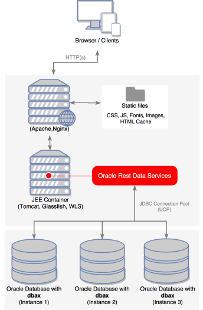
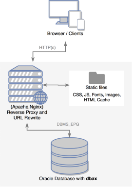

# Installation


## Server Requirements

The dbax framework has a few system requirements, you will need to make sure your server meets the following requirements:

- Oracle Database 11g or greater.
- PL/SQL Gateway
		- ORDS 
		- DBMS_EPG 


## Architecture Overview

### dbax with ORDS as PL/SQL Gateway

To use ORDS as plsql gateway is necessary to deploy it in a JEE container. Our recommendation goes to use a web server to serve the static content, URL rewrite and perform a reverse proxy to the JEE container where the `ords.war` is deployed. ORDS can be configured for multiple Oracle database instances where dbax is installed.



### dbax with DBMS_EPG as PL/SQL Gateway

If you decide to use DBMS_EPG as PL/SQL gateway, then we recommend you use a web server to serve the static content, URL rewrite and perform a reverse proxy to the Oracle database where dbax is installed.




## dbax installation

If you already have access to an oracle database, installing dbax is very simple. You will need to have a user with the `RESOURCE` role. Just download the source code and compile it.

```sh
git clone https://github.com/osalvador/dbax-lite.git
cd dbax-lite/source/install
sqlplus "user/userpass"@SID @dbax-lite-install.sql
```


RESOURCE role has the following grants:

```sql
CREATE PROCEDURE	
CREATE SEQUENCE
CREATE TABLE	
CREATE TRIGGER	
CREATE TYPE	
```


## How to get an Oracle database

### For development environment

#### Oracle Database 11g Express Edition

From Oracle page:

> Oracle Database 11g Express Edition (Oracle Database XE) is an entry-level, small-footprint database based on the Oracle Database 11g Release 2 code base. It's free to develop, deploy, and distribute; fast to download; and simple to administer.

[Oracle Database 11g Express Edition >](http://www.oracle.com/technetwork/database/database-technologies/express-edition/overview/index.html)

#### Oracle Pre-Built Developer VMs

Oracle provides pre-built developer virtual machines available for free download. From Oracle page:

> [Oracle Pre-Built Developer VMs (for Oracle VM VirtualBox) >](http://www.oracle.com/technetwork/community/developer-vm/index.html). Learning your way around a new software stack is challenging enough without having to spend multiple cycles on the install process. Instead, we have packaged such stacks into pre-built Oracle VM VirtualBox appliances that you can download, install, and experience as a single unit. Just downloaded/assemble the files, import into VirtualBox (available for free), import, and go (but not for production use or redistribution)!

The recommended virtual machine for dbax 

[Database App Development VM >](http://www.oracle.com/technetwork/community/developer-vm/index.html#dbapp)

#### Docker Image

Unofficial docker image

[Oralce XE 11g >](https://hub.docker.com/r/wnameless/oracle-xe-11g/)


### For production environment

#### Buy Oracle Database License

[Oracle Database 12c Standard Edition 2 >](https://www.oracle.com/database/standard-edition-two/index.html)


#### Oracle Database 11g Express Edition

> Oracle Database 11g Express Edition (Oracle Database XE) is an entry-level, small-footprint database based on the Oracle Database 11g Release 2 code base. It's free to develop, deploy, and distribute; fast to download; and simple to administer. 

[Oracle Database 11g Express Edition >](http://www.oracle.com/technetwork/database/database-technologies/express-edition/overview/index.html)

#### Amazon RDS for Oracle Database

> Oracle® Database is a relational database management system developed by Oracle. Amazon RDS makes it easy to set up, operate, and scale Oracle Database deployments in the cloud. With Amazon RDS, you can deploy multiple editions of Oracle Database in minutes with cost-efficient and re-sizable hardware capacity. Amazon RDS frees you up to focus on application development by managing time-consuming database administration tasks including provisioning, backups, software patching, monitoring, and hardware scaling.

[Amazon RDS for Oracle Database >](https://aws.amazon.com/en/rds/oracle/)

## Configure a PL/SQL Gateway

### ORDS Installation 

[Oracle Rest Data Services](http://www.oracle.com/technetwork/developer-tools/rest-data-services/overview/index.html) (ORDS), formerly known as the APEX Listener, allows PL/SQL Web applications to be deployed. ORDS can be deployed on WebLogic, Glassfish or Tomcat. This article describes the installation of ORDS on Tomcat 7 and 8.

#### Download

[Download ORDS >](http://www.oracle.com/technetwork/developer-tools/rest-data-services/downloads/index.html)

#### Install ORDS for dbax

Just unzip the software and run `java -jar ords.war install advanced`. 

```
[tomcat@dbaxio tmp]$ unzip ords.3.0.9.348.07.16.zip
	...
	inflating: examples/soda/getting-started/QBE.3.json
	inflating: examples/soda/getting-started/QBE.4.json
	inflating: examples/soda/getting-started/po.json
	inflating: examples/soda/getting-started/poUpdated.json
	inflating: ords.war
	inflating: params/ords_params.properties
	inflating: readme.html

[tomcat@dbaxio tmp]$ java -jar ords.war install advanced
This Oracle REST Data Services instance has not yet been configured.
Please complete the following prompts

Enter the location to store configuration data:/u01/ords/conf
Enter the name of the database server [localhost]:
Enter the database listen port [1521]:
Enter 1 to specify the database service name, or 2 to specify the database SID [1]:2
Enter the database SID [xe]:
Enter 1 if you want to verify/install Oracle REST Data Services schema or 2 to skip this step [1]:2
Enter 1 if you want to use PL/SQL Gateway or 2 to skip this step.
If using Oracle Application Express or migrating from mod_plsql then you must enter 1 [1]:1
Enter the PL/SQL Gateway database user name [APEX_PUBLIC_USER]:dbax
Enter the database password for dbax:
Confirm password:
Enter 1 to specify passwords for Application Express RESTful Services database users (APEX_LISTENER, APEX_REST_PUBLIC_USER) or 2 to skip this step [1]:2
Feb 07, 2017 9:01:49 AM
INFO: Updated configurations: defaults, apex
Enter 1 if you wish to start in standalone mode or 2 to exit [1]:2
```


#### These are the typical responses for an Oracle Express database:

- Enter the location to store configuration data: **/u01/ords/conf**
- Enter the name of the database server [localhost]: **localhost**
- Enter the database listen port [1521]: **1521**
- Enter 1 to specify the database service name, or 2 to specify the database SID [1]: **2**
- Enter the database SID [xe]: **xe**
- Enter 1 if you want to verify/install Oracle REST Data Services schema or 2 to skip this step [1]: **2**
- Enter 1 if you want to use PL/SQL Gateway or 2 to skip this step. If using Oracle Application Express or migrating from mod_plsql then you must enter 1 [1]: **1**
- Enter the PL/SQL Gateway database user name [APEX_PUBLIC_USER]: **DBAX_USERNAME**
- Enter the database password for dbax: **passwd**
- Confirm password: **passwd**
- Enter 1 to specify passwords for Application Express RESTful Services database users (APEX_LISTENER, APEX_REST_PUBLIC_USER) or 2 to skip this step [1]: **2**
- Enter 1 if you wish to start in standalone mode or 2 to exit [1]: **2**

#### Deploy in Tomcat

Copy the `ords.war` file to the Tomcat webapps directory.

```sh
[tomcat@dbaxio tmp]$ cp ords.war $CATALINA_HOME/webapps/
```

ORDS should now be accessible using the following type of URL.

```
http://<server-name>:<port>/ords/<appid>
```


### DBMS_EPG configuration 

> The [DBMS_EPG](https://docs.oracle.com/cd/B28359_01/appdev.111/b28419/d_epg.htm#CHDIDGIG) package implements the embedded PL/SQL gateway that enables a web browser to invoke a PL/SQL stored procedure through an HTTP listener.

#### Configure HTTP Access

In order to access a XML DB web service, the HTTP port number of the XML DB built in HTTP server must be configured using the DBMS_XDB package. The GETHTTPPORT function displays the current port number setting. If you've not used the XML DB HTTP server before, it will probably be set to "0" which means HTTP access is disabled. Use the SETHTTPPORT procedure to set the port number to a non-zero value. In most of their examples, Oracle use the value of "8080".

```sql
 SQL> EXEC dbms_xdb.sethttpport(8080);
  PL/SQL procedure successfully completed.

 SQL> SELECT dbms_xdb.gethttpport FROM dual;
  GETHTTPPORT
  ----------- 
  8080
```


#### Create DAD

```sql
BEGIN
   DBMS_EPG.drop_dad ('DBAX');
END;

BEGIN
   DBMS_EPG.create_dad (dad_name => 'DBAX', PATH => '/dbax/*');
END;

BEGIN
   DBMS_EPG.set_dad_attribute (dad_name     => 'DBAX',
                               attr_name    => 'error-style',
                               attr_value   => 'DebugStyle');

   DBMS_EPG.set_dad_attribute (dad_name     => 'DBAX',
                               attr_name    => 'database-username',
                               attr_value   => '<DBAX USERNAME>');

   DBMS_EPG.set_dad_attribute (dad_name     => 'DBAX',
                               attr_name    => 'session-state-management',
                               attr_value   => 'StatelessWithFastResetPackageState');                               
END;

BEGIN
   DBMS_EPG.authorize_dad (dad_name => 'DBAX', USER => '<DBAX USERNAME>');   
END;
```

DBMS_EPG should now be accessible using the following type of URL.

```
http://<server-name>:<port>/dbax/<appid>
```


#### Limitations

DBMS_EPG has some limitations

- Custom headers: DBMS_EPG does not allow to send custom HTTP headers, so in order to be able to do Method Override, dbax uses the `X-ORACLE-CACHE-ENCRYPT` HTTP Header reserved by Oracle.

```
	X-ORACLE-CACHE-ENCRYPT: PUT
	X-ORACLE-CACHE-ENCRYPT: PATCH
	X-ORACLE-CACHE-ENCRYPT: DLETE
	X-ORACLE-CACHE-ENCRYPT: OPTIONS
```

- HttpOnly cookies: DBMS_EPG only allows sending a single HttpOnly cookie to clients. Consecutive sent cookies are ignored. You can customize this parameter, which defaults is set to true. 

```sql
response_.cookie('name', 'value', l_20_minutes, p_httpOnly => false );
```


## Web Server Configuration

### Pretty URLs

dbax uses the query string parameter `p` to identify the URI entered by the user. In this way and with a simple URL rewrite, dbax has pretty and clean URLs. 

#### Nginx

If you are using Nginx, the following directive in your site configuration will direct all requests to the *application fron contrller* in your PL/SQL Gateway, making a reverse proxy:

Rewrite and proxy from  `http://example.com/home` to `http://127.0.0.1:8080/ords/!example?p=/home`

```
location / {    
    rewrite  ^/(.*) /ords/!example?p=/$1  break;

    proxy_pass  http://127.0.0.1:8080;
}
```


Rewrite and proxy from `http://example.com/greeting/home` to `http://127.0.0.1:8080/ords/!greeting?p=/home`

```
 location /greeting/ {
        rewrite  ^/(.*) /ords/!greeting?p=$1  break;        

        proxy_pass  http://127.0.0.1:8080;
    }

```

#### Tomcat

Tomcat from version 8 implements [URL rewrite functionality](https://tomcat.apache.org/tomcat-8.0-doc/rewrite.html) in a way that is very similar to mod_rewrite from Apache HTTP Server.

Essentially, all you need to do is include the rewrite valve class `org.apache.catalina.valves.rewrite.RewriteValve` in your application's context. This can be either the global `context.xml` or in the context block of a host in the `server.xml`; both found in Tomcat's `${TOMCAT_HOME}/conf` directory. Then drop a `rewrite.config` file containing your rewrites into the WEB-INF folder of `${TOMCAT_HOME}/webapps/ROOT/WEB-INF` or wherever your application's root WEB-INF. Using the global `context.xml` will effect all virtual host setups you've defined in your `server.xml` so if you have multiple apps running, it may be best to do a per host setup of the rewrite valve.


##### Global Configuration

Set the rewrite valve in Tomcat's `context.xml` located in `${TOMCAT_HOME}/conf/context.xml`:

```xml
<?xml version='1.0' encoding='utf-8'?>
<!-- The contents of this file will be loaded for each web application -->
<Context>
  
 	  <!-- REWRITE VALVE -->
    <Valve className="org.apache.catalina.valves.rewrite.RewriteValve" />
    <!-- // -->
	
    <!-- Default set of monitored resources. If one of these changes, the    -->
    <!-- web application will be reloaded.                                   -->
    <WatchedResource>WEB-INF/web.xml</WatchedResource>
    <WatchedResource>${catalina.base}/conf/web.xml</WatchedResource>
</Context>
```

##### Making it all happen with `rewrite.config`

Now you can drop your `rewrite.config` into the WEB-INF there. Here's an example `rewrite.config` that rewrites the URL to greeting application. The file must be located in `${TOMCAT_HOME}/webapps/ROOT/WEB-INF/rewrite.config`


Rewrite from  `http://host:port/greeting/home` to `http://host:port/ords/!greeting?p=/home`

```
RewriteRule /greeting(.*?)$ /ords/!greeting?p=$1 [L]
```

