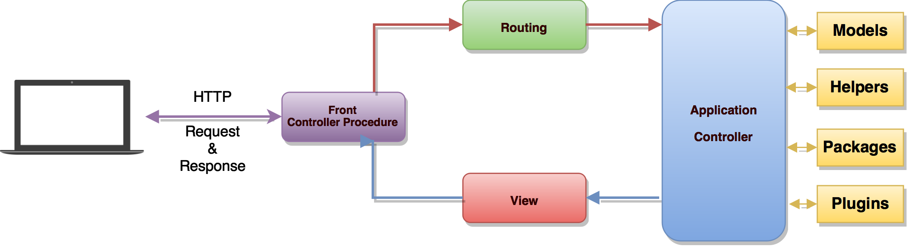

# Request Lifecycle

## Introduction

When using any tool in the "real world", you feel more confident if you understand how that tool works. Application development is no different. When you understand how your development tools function, you feel more comfortable and confident using them.

The goal of this document is to give you a good, high-level overview of how the **dbax** framework works. By getting to know the overall framework better, everything feels less "magical" and you will be more confident building your applications. If you don't understand all of the terms right away, don't lose heart! Just try to get a basic grasp of what is going on, and your knowledge will grow as you explore other sections of the documentation.


## Lifecycle Overview



### First Things

The entry point for all requests to a **dbax** application is the public *application front controller procedure*  All requests are directed to this procedure by your PLSQL Gateway (ORDS / DBMS_EPG) configuration. The *application front controller procedure* doesn't contain much code. Rather, it is simply a starting point for loading the rest of the framework.

The *application front controller procedure* loads your application properties and inject to the framework the routing function of your application. Then start the dispatcher. 

Application front controller procedure example: 

```sql
CREATE OR REPLACE PROCEDURE greeting (name_array    IN owa_util.vc_arr DEFAULT dbx.empty_vc_arr
                                    , value_array   IN owa_util.vc_arr DEFAULT dbx.empty_vc_arr )
AS
   -- Unique application ID Name
   l_appid CONSTANT   VARCHAR2 (100) := 'GREETING';
BEGIN
   -- Custom aplication properties  
   dbx.set_property('error_style', 'DebugStyle');   
   -- dbax framework kernel 
   dbx.dispatcher (p_appid     => l_appid
                 , name_array  => name_array
                 , value_array => value_array
                 , router      => 'PK_APP_GREETING.ROUTER');
END greeting;
/
```


### HTTP / Dispatcher

Next, the incoming request is sent to either the HTTP dispatcher. This dispatcher serve as the central location that all requests flow through.

The HTTP Dispatcher detect user inputs, load cookies, start user session and perform other tasks that need to be done before the routing is actually handled.

The method signature for the HTTP Dispatcher's handle method is quite simple: receive a user's request and application router and return a response to the user. Think of the Dispatcher as being a big black box that represents your entire application. Feed it HTTP requests and it will return HTTP responses.

Once the application has been bootstrapped, the request will be handed off to the application router for dispatching. The router will dispatch the request to a route or controller.
