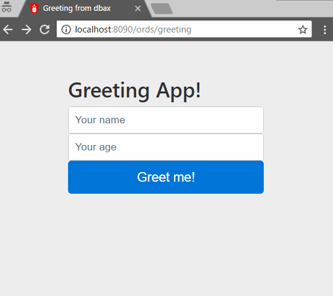

# Greeting Application

Simple application that greets the user.

The [PRG](https://en.wikipedia.org/wiki/Post/Redirect/Get) pattern is used to prevent duplicate form submissions. Saving user inputs in session and `pull` when needed. 





## Source code explanation

### Front controller procedure

The entry point for all requests to a **greeting** application.

Define `APPID` and custom application properties. Sends as `router` argument the name of the function that contains the application rounting.

```sql
CREATE OR REPLACE PROCEDURE greeting (name_array    IN owa_util.vc_arr DEFAULT dbx.empty_vc_arr
                                    , value_array   IN owa_util.vc_arr DEFAULT dbx.empty_vc_arr )
AS
   -- Unique application ID Name
   l_appid CONSTANT   VARCHAR2 (100) := 'GREETING';
BEGIN
   -- Custom aplication properties  
   dbx.set_property('error_style', 'DebugStyle');   
   -- dbax framework kernel 
   dbx.dispatcher (p_appid     => l_appid
                 , name_array  => name_array
                 , value_array => value_array
                 , router      => 'PK_APP_GREETING.ROUTER');
END greeting;
/
```


### Application Router

Simply set routes and HTTP verbs to which the application listens and invokes the appropriate controller.

```sql
FUNCTION router
  RETURN CLOB
AS
BEGIN
    IF route_.get ('/')
    THEN
     RETURN greeting_controller ();
    END IF;

    IF route_.post ('/')
    THEN
     RETURN user_inputs_controller ();
    END IF;
END;
```

### Greeting controller

This controller retrieves the user's session data and sends it to view. 

Also two more variables are defined that are sent to the view. The `base_path` that sets the base url of the application and `resources_url` that sets the url base of the external resources.

```sql
FUNCTION greeting_controller
  RETURN CLOB
AS
    l_input_name   VARCHAR2 (3000);
    l_input_age    PLS_INTEGER;
BEGIN
    l_input_name := session_.pull ('l_input_name');
    l_input_age := session_.pull ('l_input_age');

    view_.data ('l_input_name', l_input_name);
    view_.data ('l_input_age', l_input_age);

    /* Properties frequently  used in views  */   
    view_.data ('base_path', dbx.get_property ('base_path'));
    view_.data ('resources_url', 'http://v4-alpha.getbootstrap.com');

    RETURN view_.run (greeting_view (), 'greeting');
END greeting_controller;
```

### User inputs controller

This controller that executes with the POST of the form, retrive the inputs of the user, saves them in the session and redirects the user to the home.

```sql
FUNCTION user_inputs_controller
  RETURN CLOB
AS
    l_input_name   VARCHAR2 (300);
    l_input_age    PLS_INTEGER;
BEGIN
    l_input_name := request_.input ('inputName');
    l_input_age := request_.input ('inputAge');

    session_.set ('l_input_name', l_input_name);
    session_.set ('l_input_age', l_input_age);

    dbx.redirect ('/');
    RETURN NULL;
END user_inputs_controller
```

### Greeting View

This view based on the [bootstrap login example](https://getbootstrap.com/examples/signin/), shows a form to the user in case the session variable `l_input_name` is null. If the session data is not null, shows a greeting message. 

```html
FUNCTION greeting_view
  RETURN CLOB
AS
BEGIN
    RETURN q'[<!DOCTYPE html>
    <html lang="en">
      <head>
        <meta charset="utf-8">
        <meta name="viewport" content="width=device-width, initial-scale=1, shrink-to-fit=no">
        <meta name="description" content="Simple Greerting application">
        <meta name="author" content="Oscar Salvador Magallanes">
        
        <title>Greeting from dbax</title>

        <!-- Bootstrap core CSS -->
        <link href="${resources_url}/dist/css/bootstrap.min.css" rel="stylesheet">

        <!-- Custom styles for this template -->
        <link href="${resources_url}/examples/signin/signin.css" rel="stylesheet">
      </head>

      <body>

        <div class="container">

          <% if l_input_name is not null then%>
              <h2>Hi <%= l_input_name %>! you are <%= l_input_age %> years old</h2>
          <% else %>
              <form class="form-signin" method="POST" action="${base_path}/">
                <h2 class="form-signin-heading">Greeting App!</h2>
                <label for="inputName" class="sr-only">Your name</label>
                <input type="text" name="inputName" id="inputName" class="form-control" placeholder="Your name" required autofocus>
                <label for="inputAge" class="sr-only">Your age</label>
                <input type="number" name="inputAge" id="inputAge" class="form-control" placeholder="Your age" required>
                <button class="btn btn-lg btn-primary btn-block" type="submit">Greet me!</button>
              </form>
          <% end if; %>

        </div> <!-- /container -->


        <!-- Bootstrap core JavaScript
        ================================================== -->
        <!-- Placed at the end of the document so the pages load faster -->
        <!-- IE10 viewport hack for Surface/desktop Windows 8 bug -->
        <script src="${resources_url}/assets/js/ie10-viewport-bug-workaround.js"></script>
      </body>
    </html>]';
END greeting_view;
```